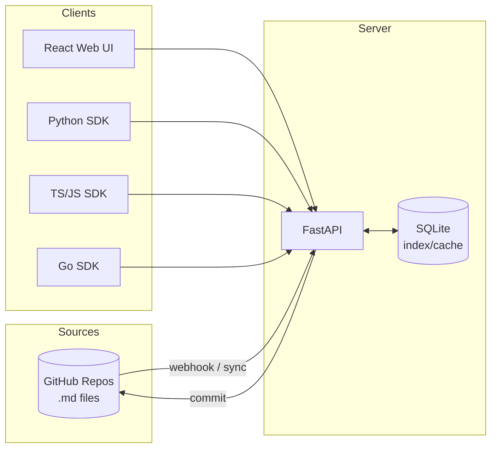

# OSS README Overhaul Plan

## Context

Promptdis has a comprehensive but internally-focused README (~470 lines). It's missing the polish, visual elements, and community signals expected of a public open-source project. The goal is to rewrite it as a professional OSS README that makes a strong first impression on GitHub — with logo, badges, screenshots, architecture diagram, and proper community files (LICENSE, CONTRIBUTING). The current README content is excellent; this is about presentation and completeness, not rewriting the substance.

**Key gaps identified:**
- No LICENSE file (MIT stated in README but no file)
- No badges (CI, license, version, language)
- No logo/hero image in README
- No screenshots of the web UI
- No CONTRIBUTING.md or GitHub issue/PR templates
- No "Why Promptdis" positioning section
- No community/support links
- Architecture diagram is ASCII — could be Mermaid (GitHub-native)

**Important constraint:** Remove all references to "FutureSelf" from the README and public-facing files. SDK code examples that use `futureself` as org/app names in API calls should be changed to generic names like `"myorg"`, `"myapp"`. The Go module path (`github.com/futureself-app/promptdis-go`) stays as-is since it's a published import path, but README prose should not mention FutureSelf as the company behind the project.

---

## 1. Create `LICENSE` file

**File:** `LICENSE`

Standard MIT license text with `Copyright (c) 2026 Loren Winzeler`.

---

## 2. Create logo assets for README

**File:** `docs/assets/logo.svg` — copy from `web/public/logo.svg`
**File:** `docs/assets/logo-banner.svg` — new ~600x200 banner: logo + "Promptdis" wordmark + tagline

The banner SVG will use the existing brand colors from BRANDING.md:
- Background: transparent (works on light and dark GitHub themes)
- Logo circle: `#1f2937` with `< >` brackets in `#f9fafb` and `#3b82f6` lightning bolt
- "Promptdis" text: `#1f2937` (or `#f9fafb` variant for dark mode — pick one that works on both)
- Tagline: "Git-native LLM prompt management" in `#4b5563`

Since SVG text rendering varies across browsers, an alternative is to create a simple centered layout with just the logo icon + keep the text as markdown below it. This is the safer approach — **recommended: center the existing `logo.svg` at ~120px and use markdown for the title/tagline below it.**

---

## 3. Capture UI screenshots

**Directory:** `docs/assets/screenshots/`

4 screenshots to capture (from the running web app):
1. `dashboard.png` — Analytics dashboard (requests/day chart, cache stats, top prompts)
2. `prompt-browser.png` — Prompt browser grid with search and filters
3. `prompt-editor.png` — Split-pane editor (YAML form + CodeMirror body)
4. `evaluation.png` — Eval results table

These will be captured using Playwright's screenshot tool from the running dev server, or manually. Each should be ~1200px wide, optimized to <200KB.

**If the server isn't running or there's no seed data:** Create placeholder references in the README with HTML comments `<!-- screenshot: dashboard -->` and a note to add them later. The README structure shouldn't block on screenshots.

---

## 4. Rewrite `README.md` — New Structure

**File:** `README.md` (complete rewrite, ~550 lines)

### Section-by-section plan:

#### Header Block (lines 1-15)
```markdown
<p align="center">
  
</p>

<h1 align="center">Promptdis</h1>
<p align="center">Git-native LLM prompt management platform</p>

<p align="center">
  <a href="..."></a>  <!-- badges row -->
</p>
```

**Badges (shields.io):**
- ``
- ``
- ``
- ``
- ``
- ``

#### Quick Nav Links (line ~17)
```markdown
<p align="center">
  <a href="#getting-started">Getting Started</a> ·
  <a href="#sdks">SDKs</a> ·
  <a href="docs/API.md">API Docs</a> ·
  <a href="#contributing">Contributing</a>
</p>
```

#### What is Promptdis? (~5 lines)
2-3 sentence value prop. What it does, who it's for, why it exists. Lead with the problem, not the tech.

> Store LLM prompts as Markdown files in GitHub. Edit them through a web UI. Fetch them at runtime via SDK with automatic caching. No more hardcoded prompts, no more redeploys to change a system message.

#### Screenshot (if available)
Single hero screenshot of the editor or dashboard, centered. Wrapped in `<details>` if multiple.

#### Key Features (~20 lines)
Bulleted list with brief descriptions. Reuse existing content but tighten:
- **GitHub is the source of truth** — prompts live as `.md` files with YAML front-matter
- **Web editor** — split-pane YAML form + CodeMirror body editor
- **4 SDKs** — Python, TypeScript, JavaScript, Go — with LRU cache + ETag revalidation
- **Jinja2 rendering** — server-side templates with variables, conditionals, loops, includes
- **Evaluations** — run promptfoo evals from the UI, auto-generate tests with PromptPex
- **Environment promotion** — dev → staging → production with Git commits
- **Analytics** — API usage, cache hit rates, top prompts, per-key consumption
- **TTS preview** — render + synthesize audio via ElevenLabs in the editor
- **Prompty compatible** — import/export Microsoft .prompty format
- **Batch operations** — bulk update model, environment, tags in a single commit

#### Why Promptdis? (~15 lines)
Comparison table positioning against alternatives:

| | Promptdis | LangChain Hub | Vellum | Hardcoded |
|---|---|---|---|---|
| Source of truth | Git (your repo) | Cloud | Cloud | Code |
| Self-hosted | Yes | No | No | N/A |
| Version history | Git log | Limited | Yes | Git log |
| Hot reload | Yes (SDK cache) | Yes | Yes | No (redeploy) |
| Eval framework | Built-in (promptfoo) | No | Yes | No |
| Open source | MIT | Partial | No | N/A |

#### Architecture (~15 lines)
Mermaid diagram replacing the ASCII art. GitHub renders Mermaid natively.



#### Tech Stack table
Keep the existing compact table format — it's already good.

#### Getting Started (~40 lines)
Keep existing structure (prerequisites, clone, install, configure, start). Clean up slightly:
- Merge the `cp .env.example .env` block
- Streamline to fewer steps
- Add Docker one-liner alternative prominently

#### Prompt File Format (~15 lines)
Keep the YAML front-matter example — it's one of the most compelling parts. Trim slightly.

#### SDKs (~40 lines)
Keep the 4-SDK section. Add Go SDK (currently missing from README SDK section).

**Go SDK subsection to add:**
```markdown
### Go

```bash
go get github.com/futureself-app/promptdis-go
```

```go
client, err := promptdis.NewClient(promptdis.ClientOptions{
    BaseURL: "http://localhost:8000",
    APIKey:  "pm_live_...",
})
defer client.Close()

ctx := context.Background()
prompt, err := client.GetByName(ctx, "myorg", "myapp", "greeting")
rendered := client.RenderLocal(prompt.Body, map[string]string{"name": "Alice"})
```

See [`sdk-go/README.md`](sdk-go/README.md) for full documentation.
```

#### Examples (~10 lines)
Keep existing table linking to `sdk-*/examples/`.

#### API Overview (~25 lines)
Keep existing endpoint tables — compact and useful.

#### Web UI (~15 lines)
Keep existing page table but add a screenshot reference.

#### Key Features (detailed) (~30 lines)
Keep: prompt composition, environment promotion, evaluations, Prompty, TTS, batch ops. Consolidate slightly.

#### Project Structure (~30 lines)
Keep the tree view — it's genuinely useful for contributors.

#### Testing (~10 lines)
Keep existing. Add badge reference.

#### Deployment (~10 lines — NEW)
Brief section linking to:
- `docker compose up` for local
- `RUNBOOK.md` for production container deployment
- `docs/serverless/` for AWS Lambda

#### Contributing (~10 lines — NEW)
Brief section with:
- Link to `CONTRIBUTING.md`
- "PRs welcome" messaging
- Link to GitHub Issues

#### License (~3 lines)
```markdown
## License

[MIT](LICENSE) - see the [LICENSE](LICENSE) file for details.
```

#### Links/Community (~5 lines — NEW)
- GitHub Issues
- GitHub Discussions (if enabled)
- Full API docs link

---

## 5. Create `CONTRIBUTING.md`

**File:** `CONTRIBUTING.md` (~80 lines)

Sections:
1. **Welcome** — brief, encouraging tone
2. **Development Setup** — clone, install backend (uv sync), install frontend (cd web && npm install), run both
3. **Running Tests** — pytest, vitest commands (already in README)
4. **Code Style** — ruff for Python, TypeScript strict mode, mention existing CI checks
5. **Pull Request Process** — fork, branch, PR against main, describe changes, CI must pass
6. **Reporting Bugs** — use GitHub Issues, include steps to reproduce
7. **Feature Requests** — use GitHub Issues with "enhancement" label

---

## 6. Create GitHub templates

**File:** `.github/ISSUE_TEMPLATE/bug_report.md` (~30 lines)
Standard bug template: description, steps to reproduce, expected vs actual, environment.

**File:** `.github/ISSUE_TEMPLATE/feature_request.md` (~20 lines)
Feature template: problem description, proposed solution, alternatives considered.

**File:** `.github/pull_request_template.md` (~20 lines)
PR template: summary, type of change checkboxes, testing done.

---

## 7. Create `docs/assets/` directory structure

```
docs/
  assets/
    logo.svg                    # Copied from web/public/logo.svg
    screenshots/
      (placeholder — capture when server is running)
```

The logo copy ensures README image links work from the repo root without depending on `web/public/` path (which looks implementation-specific in a README context).

---

## 8. Graphics recommendations

### What to add now (SVG/text-based, no screenshots needed):
1. **Centered logo** — `docs/assets/logo.svg` at 120px width
2. **Mermaid architecture diagram** — rendered natively by GitHub
3. **Shields.io badges** — 6 badges (license, CI, Python, Node, Go, PRs welcome)
4. **Feature comparison table** — pure markdown, no images needed

### What to add later (requires running app):
1. **Editor screenshot** — the split-pane YAML+CodeMirror view is the most compelling visual
2. **Dashboard screenshot** — analytics charts show the product is real
3. **Terminal GIF** — SDK usage showing fetch + render (asciinema or svg-term)

### What would really make it stand out:
1. **Animated SVG** of the data flow: GitHub commit → webhook → SQLite sync → SDK fetch. Could be created as a Mermaid sequence diagram.
2. **"Before/After" code comparison** showing hardcoded prompts vs Promptdis SDK usage — resonates with the problem statement.

---

## Files Summary

### New files

| File | ~Lines | Purpose |
|------|--------|---------|
| `LICENSE` | 21 | MIT license text |
| `CONTRIBUTING.md` | 80 | Contributor guide |
| `docs/assets/logo.svg` | 13 | Logo for README (copy) |
| `.github/ISSUE_TEMPLATE/bug_report.md` | 30 | Bug report template |
| `.github/ISSUE_TEMPLATE/feature_request.md` | 20 | Feature request template |
| `.github/pull_request_template.md` | 20 | PR template |

**Total: 6 new files**

### Modified files

| File | Change |
|------|--------|
| `README.md` | Complete rewrite with OSS structure, logo, badges, Mermaid diagram, Go SDK, new sections |

**Total: 1 modified file**

---

## Verification

1. **Logo renders** — open README.md on GitHub (or `grip README.md`) and verify logo displays centered
2. **Badges render** — all shields.io badges display correctly (some may show "not found" until repo is public)
3. **Mermaid renders** — architecture diagram renders in GitHub markdown preview
4. **Links work** — all internal links (LICENSE, CONTRIBUTING, sdk-*/README.md, docs/) resolve
5. **LICENSE detected** — GitHub should show "MIT License" in the repo sidebar
6. **Templates work** — create a test issue to verify bug_report.md renders
7. **Mobile readability** — check README on mobile GitHub (tables, code blocks, images should be responsive)
