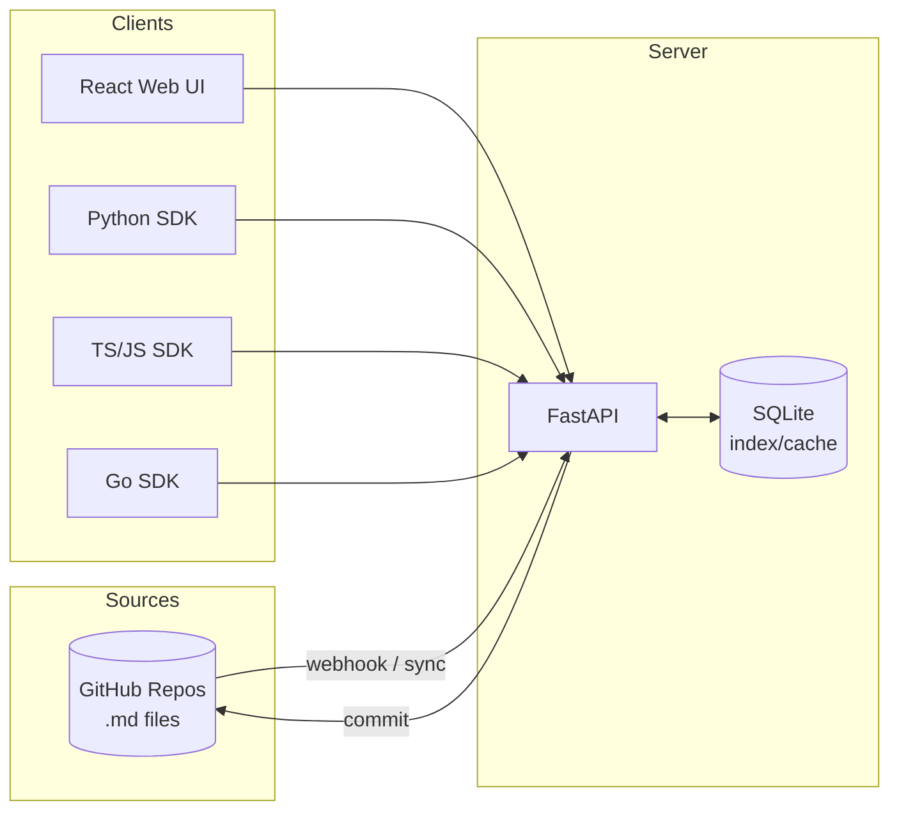

<p align="center">
  
</p>

<h1 align="center">Promptdis</h1>
<p align="center">Git-native LLM prompt management platform</p>

<p align="center">
  <a href="LICENSE"></a>
  <a href="https://github.com/futureself-app/promptdis/actions/workflows/ci.yml"></a>
  
  
  
  <a href="CONTRIBUTING.md"></a>
</p>

<p align="center">
  <a href="#getting-started">Getting Started</a> &middot;
  <a href="#sdks">SDKs</a> &middot;
  <a href="#api-overview">API Docs</a> &middot;
  <a href="#contributing">Contributing</a>
</p>

---

## What is Promptdis?

Store LLM prompts as Markdown files in GitHub. Edit them through a web UI. Fetch them at runtime via SDK with automatic caching. No more hardcoded prompts, no more redeploys to change a system message.

Promptdis treats **GitHub as the source of truth** for your prompts — every edit is a Git commit, every rollback is a `git revert`, and your prompt history lives in `git log`. A FastAPI server indexes prompts into SQLite for fast search, while SDKs fetch them at runtime with LRU caching and ETag revalidation.

<!-- TODO: Add hero screenshot of the editor when available -->

## Key Features

- **GitHub is the source of truth** — prompts live as `.md` files with YAML front-matter in your repos
- **Web editor** — split-pane UI: structured YAML form + CodeMirror body editor with diff view
- **4 SDKs** — Python, TypeScript, JavaScript, Go — all with LRU cache + ETag revalidation
- **Jinja2 rendering** — server-side templates with variables, conditionals, loops, and includes
- **Evaluations** — run [promptfoo](https://www.promptfoo.dev/) evals from the UI, auto-generate tests with [PromptPex](https://microsoft.github.io/promptpex/)
- **Environment promotion** — dev → staging → production with Git commits
- **Analytics** — API usage, cache hit rates, top prompts, per-key consumption
- **TTS preview** — render + synthesize audio via ElevenLabs in the editor
- **Prompty compatible** — import/export Microsoft [.prompty](https://prompty.ai/) format
- **Batch operations** — bulk update model, environment, tags in a single commit

## Why Promptdis?

| | Promptdis | LangChain Hub | Vellum | Hardcoded |
|---|---|---|---|---|
| Source of truth | Git (your repo) | Cloud | Cloud | Code |
| Self-hosted | Yes | No | No | N/A |
| Version history | Git log | Limited | Yes | Git log |
| Hot reload | Yes (SDK cache) | Yes | Yes | No (redeploy) |
| Eval framework | Built-in (promptfoo) | No | Yes | No |
| Open source | MIT | Partial | No | N/A |

**Before:**
```python
# Buried in application code, requires redeploy to change
SYSTEM_PROMPT = """You are a helpful assistant. Be concise and friendly..."""
```

**After:**
```python
from promptdis import PromptClient

client = PromptClient(base_url="http://localhost:8000", api_key="pm_live_...")
prompt = client.get_by_name("myorg", "myapp", "assistant")
# Hot-reloads from server, cached locally, versioned in Git
```

## Architecture



### Tech Stack

| Layer | Technology |
|-------|-----------|
| Backend | Python 3.11+ / FastAPI / aiosqlite |
| Git Integration | PyGithub (GitHub API) |
| Auth | GitHub OAuth SSO + bcrypt API keys |
| Frontend | React 18 + Vite + TailwindCSS + TypeScript |
| Editor | CodeMirror 6 |
| SDKs | Python, TypeScript, JavaScript, Go |

## Getting Started

### Prerequisites

- Python 3.11+
- Node.js 18+
- A GitHub OAuth App ([create one](https://github.com/settings/developers))

### Quick start

```bash
git clone https://github.com/futureself-app/promptdis.git
cd prompt-mgmt

# Backend
pip install -e ".[dev]"

# Frontend
cd web && npm install && cd ..

# Configure
cp .env.example .env
# Edit .env with your GitHub OAuth credentials
```

Start the servers:

```bash
# Terminal 1 - API server
uvicorn server.main:app --reload --port 8000

# Terminal 2 - Frontend
cd web && npm run dev
```

API: `http://localhost:8000` (interactive docs at `/docs`)
Web UI: `http://localhost:5173`

### Docker

```bash
docker compose up
```

This starts the API on port 8000 and the web UI on port 5173. Mount a `.env` file or pass env vars. See [RUNBOOK.md](RUNBOOK.md) for production deployment.

### First-time setup

1. Open `http://localhost:5173` and sign in with GitHub
2. Your GitHub organizations are synced automatically
3. Go to **Settings** → **Add Application** → enter a GitHub repo containing `.md` prompt files
4. Promptdis indexes all `.md` files into SQLite
5. Browse, edit, and create prompts through the web UI

## Prompt File Format

Prompts are Markdown files with YAML front-matter:

```markdown
---
name: greeting
domain: support
type: chat
role: system
version: "1.0.0"
description: Customer greeting prompt
model:
  default: gpt-4o
  temperature: 0.7
  max_tokens: 2000
environment: production
active: true
tags: [support, greeting]
---

You are a helpful support agent for {{ company_name }}.

Greet the customer {{ user.display_name }} warmly.


Welcome back! We're glad to see you again.

```

The body supports full Jinja2: `{{ variables }}`, ``, ``, ``.

## SDKs

### Python

```bash
pip install promptdis
```

```python
from promptdis import PromptClient

client = PromptClient(
    base_url="http://localhost:8000",
    api_key="pm_live_...",
)

# Fetch by name
prompt = client.get_by_name("myorg", "myapp", "greeting")

# Render with variables
rendered = prompt.render(variables={
    "company_name": "Acme",
    "user": {"display_name": "Alice", "is_returning": True},
})
```

See [`sdk-py/README.md`](sdk-py/README.md) for full documentation.

### TypeScript

```bash
npm install @promptdis/client
```

```typescript
import { PromptClient } from "@promptdis/client";

const client = new PromptClient({
  baseUrl: "http://localhost:8000",
  apiKey: "pm_live_...",
});

const prompt = await client.get("550e8400-...");
const { rendered_body } = await client.render(prompt.id, {
  company_name: "Acme",
  user: { display_name: "Alice" },
});
```

See [`sdk-ts/README.md`](sdk-ts/README.md) for full documentation.

### JavaScript

```bash
npm install @promptdis/client-js
```

```js
import { PromptClient } from "@promptdis/client-js";

const client = new PromptClient({
  baseUrl: "http://localhost:8000",
  apiKey: "pm_live_...",
});

const prompt = await client.get("550e8400-...");
const { rendered_body } = await client.render(prompt.id, {
  user: { display_name: "Alice" },
});
```

Zero dependencies, no build step, ESM + CJS. See [`sdk-js/README.md`](sdk-js/README.md) for full documentation.

### Go

```bash
go get github.com/futureself-app/promptdis-go
```

```go
client, err := promptdis.NewClient(promptdis.ClientOptions{
    BaseURL: "http://localhost:8000",
    APIKey:  "pm_live_...",
})
defer client.Close()

ctx := context.Background()
prompt, err := client.GetByName(ctx, "myorg", "myapp", "greeting")
rendered := client.RenderLocal(prompt.Body, map[string]string{"name": "Alice"})
```

See [`sdk-go/README.md`](sdk-go/README.md) for full documentation.

## Examples

Each SDK includes runnable examples:

| Language | Location | Run Command |
|----------|----------|-------------|
| Python | `sdk-py/examples/` | `python examples/main.py` |
| JavaScript | `sdk-js/examples/` | `node examples/main.mjs` |
| TypeScript | `sdk-ts/examples/` | `cd examples && npm start` |
| Go | `sdk-go/examples/basic/` | `cd examples/basic && go run .` |

All examples require `PROMPTDIS_URL` and `PROMPTDIS_API_KEY` environment variables.

## API Overview

All endpoints are under `/api/v1`. Interactive docs available at `/docs` when running.

### Public API (API key auth)

| Method | Path | Description |
|--------|------|-------------|
| `GET` | `/prompts/{id}` | Fetch prompt by UUID |
| `GET` | `/prompts/by-name/{org}/{app}/{name}` | Fetch by qualified name |
| `POST` | `/prompts/{id}/render` | Render with Jinja2 variables |

### Admin API (session auth)

| Method | Path | Description |
|--------|------|-------------|
| `GET` | `/admin/orgs` | List organizations |
| `GET` | `/admin/orgs/{id}/apps` | List applications |
| `POST` | `/admin/orgs/{id}/apps` | Create application |
| `GET` | `/admin/apps/{id}/prompts` | List prompts (search, filter, paginate) |
| `GET` | `/admin/prompts/{id}` | Prompt detail with full content |
| `POST` | `/admin/prompts` | Create prompt (commits to GitHub) |
| `PUT` | `/admin/prompts/{id}` | Update prompt (commits to GitHub) |
| `DELETE` | `/admin/prompts/{id}` | Delete prompt |
| `GET` | `/admin/prompts/{id}/history` | Git commit history |
| `POST` | `/admin/prompts/{id}/rollback` | Rollback to SHA |
| `POST` | `/admin/prompts/batch` | Batch update fields |
| `POST` | `/admin/prompts/{id}/eval` | Run evaluation |
| `POST` | `/admin/sync` | Force sync all apps |
| `GET` | `/admin/analytics/requests-per-day` | API usage chart data |
| `GET` | `/admin/analytics/top-prompts` | Most-used prompts |

### Auth & Webhooks

| Method | Path | Description |
|--------|------|-------------|
| `GET` | `/auth/github/login` | Start GitHub OAuth |
| `GET` | `/auth/github/callback` | OAuth callback |
| `POST` | `/auth/logout` | End session |
| `GET` | `/auth/me` | Current user |
| `POST` | `/webhooks/github` | GitHub push event handler |

## Web UI

| Page | Description |
|------|-------------|
| **Dashboard** | Analytics overview — requests/day chart, cache hit rate, top prompts, API key usage |
| **Prompt Browser** | Grid view with search, filters (type, environment, domain, tags), multi-select batch ops |
| **Prompt Editor** | Split-pane: YAML form (left) + CodeMirror body (right). Diff view, promote, export .prompty |
| **Prompt Preview** | Render with variables, TTS audio preview |
| **Evaluation** | Run promptfoo evals, model comparison, auto-generate tests |
| **App Settings** | GitHub repo connection, webhook configuration |
| **API Keys** | Generate and manage API keys |
| **Sync Status** | Sync history, force re-sync |

<!-- TODO: Add screenshots when available -->

## Feature Details

### Prompt Composition

Use `` to compose prompts from reusable fragments. Includes are resolved at render time from the same application. Max depth: 5 levels with circular reference detection.

### Environment Promotion

Prompts move through environments: `development` → `staging` → `production`. Promote from the editor or batch-promote from the browser. Each promotion creates a Git commit.

### Evaluations

Run [promptfoo](https://www.promptfoo.dev/) evaluations from the UI: define assertions in YAML front-matter, select models, view pass/fail results. Auto-generate test cases with [PromptPex](https://microsoft.github.io/promptpex/). CI can run evals on PRs that modify prompt files.

### Prompty Compatibility

Import and export [.prompty](https://prompty.ai/) files (Microsoft's open prompt format). Export from the editor or import via the browser — files are converted to `.md` and committed to GitHub.

### TTS Preview

For prompts with `type: tts`, render the template and synthesize audio via ElevenLabs directly in the editor. Requires `ELEVENLABS_API_KEY` in `.env`.

### Batch Operations

Select multiple prompts and apply bulk changes in a single Git commit: set environment, toggle active/inactive, promote, or delete.

## Project Structure

```
prompt-mgmt/
├── server/                  # FastAPI backend
│   ├── main.py              # App entry, lifespan, middleware
│   ├── config.py            # Pydantic Settings (env vars)
│   ├── auth/                # GitHub OAuth, sessions, API keys
│   ├── api/                 # Route handlers (public, admin, webhooks, eval)
│   ├── services/            # Business logic (github, sync, render, eval, tts)
│   ├── db/                  # aiosqlite, migrations, query modules
│   ├── models/              # Pydantic models
│   └── utils/               # Front-matter parser, crypto, prompty converter
├── web/                     # React + Vite frontend
│   └── src/
│       ├── pages/           # Route pages
│       ├── components/      # Layout, editor, prompts, eval components
│       ├── hooks/           # React Query hooks
│       ├── api/             # API client functions
│       └── lib/             # Zod schemas, constants
├── sdk-py/                  # Python SDK (pip install promptdis)
├── sdk-ts/                  # TypeScript SDK (@promptdis/client)
├── sdk-js/                  # JavaScript SDK (@promptdis/client-js)
├── sdk-go/                  # Go SDK
├── tests/                   # Python test suite
│   ├── server/              # Backend tests
│   └── sdk-py/              # SDK tests
├── .github/workflows/       # CI, prompt evals, PyPI publish
├── docker-compose.yml       # Dev environment
├── Dockerfile               # Production build
└── .env.example             # Environment template
```

## Testing

```bash
# Backend (253 tests)
python -m pytest tests/ -v

# Frontend (66 tests)
cd web && npx vitest run

# TypeScript SDK (18 tests)
cd sdk-ts && npx vitest run
```

**337 total tests** across Python backend, web frontend, and TypeScript SDK.

## Deployment

- **Local:** `docker compose up` — starts API + web UI
- **Production:** See [RUNBOOK.md](RUNBOOK.md) for container deployment guide
- **CI/CD:** GitHub Actions for lint, test, container build, and PyPI publish (see `.github/workflows/`)

## Contributing

Contributions are welcome! See [CONTRIBUTING.md](CONTRIBUTING.md) for development setup, code style, and PR guidelines.

- [Open an issue](https://github.com/futureself-app/promptdis/issues) to report bugs or request features
- [Submit a PR](https://github.com/futureself-app/promptdis/pulls) — all skill levels welcome

## License

[MIT](LICENSE) — see the [LICENSE](LICENSE) file for details.
